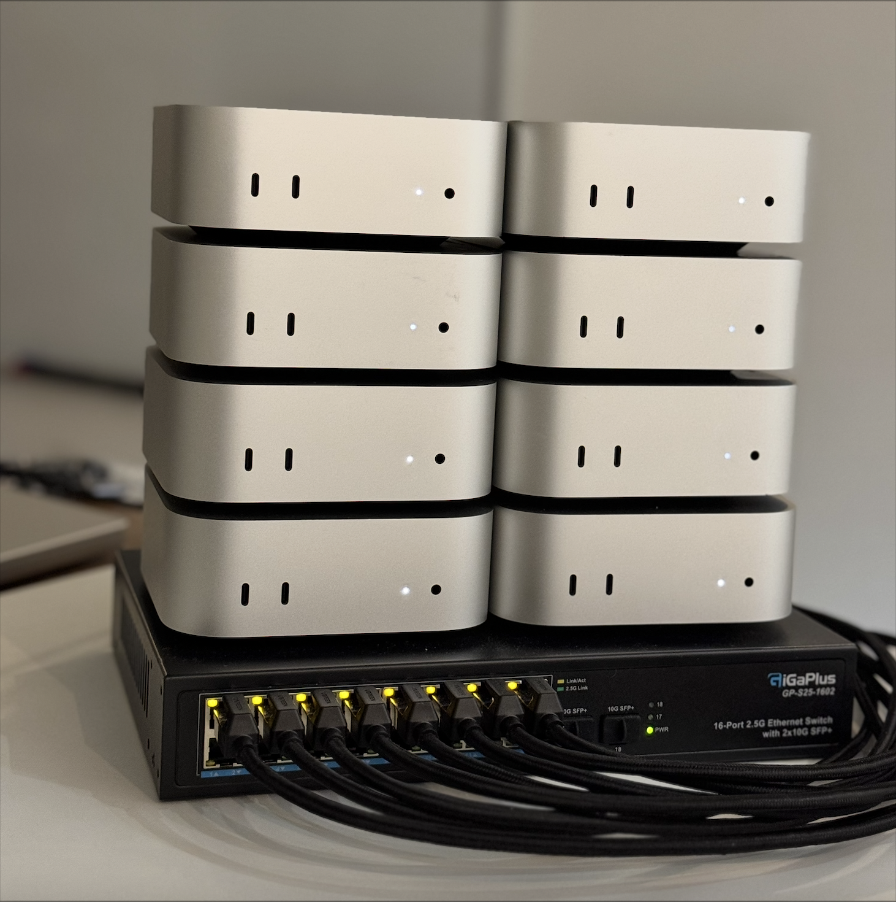

<div align="center">

# EXO Gym



<!-- New image ideas: A macbook with a loss curve on it, with a 'thinking bubbles' coming out of the macbook, and in the bubble there is a stack of 4 H100 GPUs. It's like the laptop is imagining the cluster.  -->


##### EXO Gym: Simulate distributed training on any hardware configuration, at any scale.

Simulate a GPU cluster with just your laptop! For example:

</div>

- Simulate training with SPARTA with a cluster of 4 Mac Studios connected over Ethernet
- Simulate training with DiLoCo on a cluster of 16 H100's connected over the internet

## What Does EXO Gym Do?

- Simulate distributed training without setting up distributed clusters; avoid Kubernetes, GPU hosting, etc.
- Fast iteration: implementing a new distributed training algo from scratch takes as little as 5 lines
- Scale up number of nodes by changing a single parameter

<!-- Bullet this -->
<!-- Forget about high GPU bills 💸 and painful Kubernetes setup 🤯. 
Want to scale up from 4 to 8 nodes? Just change a single parameter 🔧 
Implementing a new algo from scratch takes as little at 5 lines 🚀 -->

## Supported Algorithms

- AllReduce (Equivalent to PyTorch [DDP](https://arxiv.org/abs/2006.15704))
- [FedAvg](https://arxiv.org/abs/2311.08105)
- [DiLoCo](https://arxiv.org/abs/2311.08105)
- [SPARTA](https://openreview.net/forum?id=stFPf3gzq1)
- [DeMo](https://arxiv.org/abs/2411.19870)

... and anything else you can imagine! Implementing new algorithms with EXO Gym is very simple - see <a href='#custom-algorithms'>Custom Algorithms</a>.


## Installation

### Basic Installation
Install with core dependencies only:
```bash
pip install --index-url https://test.pypi.org/simple/ --extra-index-url https://pypi.org/simple/ exogym
```

### Installation with Optional Features

Optional feature flags allowed are:

```bash
wandb,gpt,demo,examples,dev,all
```

For example, `pip install exogym[demo]`

### Development Installation

To install for development:
```bash
git clone https://github.com/exo-explore/gym.git exogym
cd exogym
pip install -e ".[dev]"
```

## Usage

### Example Scripts

MNIST comparison of DDP, DiLoCo, and SPARTA:

```bash
python example/mnist.py
```

NanoGPT Shakespeare DiLoCo:

```bash
python example/nanogpt_train.py --dataset shakespeare --strategy diloco
```


### Custom Training

```python
from exogym import Trainer
from exogym.strategy.diloco import DiLoCoStrategy

train_dataset, val_dataset = ...
model = ... # model.forward() expects a batch, and returns a scalar loss

trainer = Trainer(model, train_dataset, val_dataset)

# Strategy for optimization & communication
strategy = DiLoCoStrategy(
  inner_optim='adam',
  H=100
)

trainer.fit(
  strategy=strategy,
  num_nodes=4,
  device='mps'
)
```

### Custom Algorithms

`example/playground.py` is a minimal starting-point for writing new algorithms. For example, to implement gradient quantization from scratch:

```python
class QuantizationStrategy(Strategy):
    def __init__(self, optim_spec, quantization_level: Literal['int8']):
        super().__init__()
        self.optim_spec = optim_spec
        self.scale = 0.024
        self.zero_point = 0
        self.qdtype = torch.uint8

    def step(self):
        for param in self.model.parameters():
            if param.grad is not None:
                quantized = torch.round(param.grad / self.scale + self.zero_point).clamp(0, 255).to(self.qdtype)
                
                q_wide = quantized.to(torch.int32)
                all_reduce(q_wide)
                
                param.grad = (q_wide.to(torch.float32) * self.scale) / self.num_nodes

        self.optim.step()
        super().step()
```


## Supported Devices

- CPU
- CUDA
- MPS (CPU-bound for copy operations, see [here](https://github.com/pytorch/pytorch/issues/141287))


## Technical Details

For further details on how EXO Gym works under-the-hood, please see [docs/](docs/README.md).