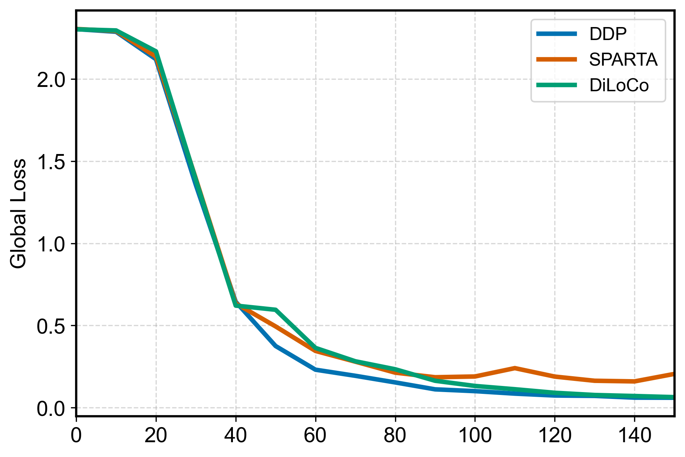
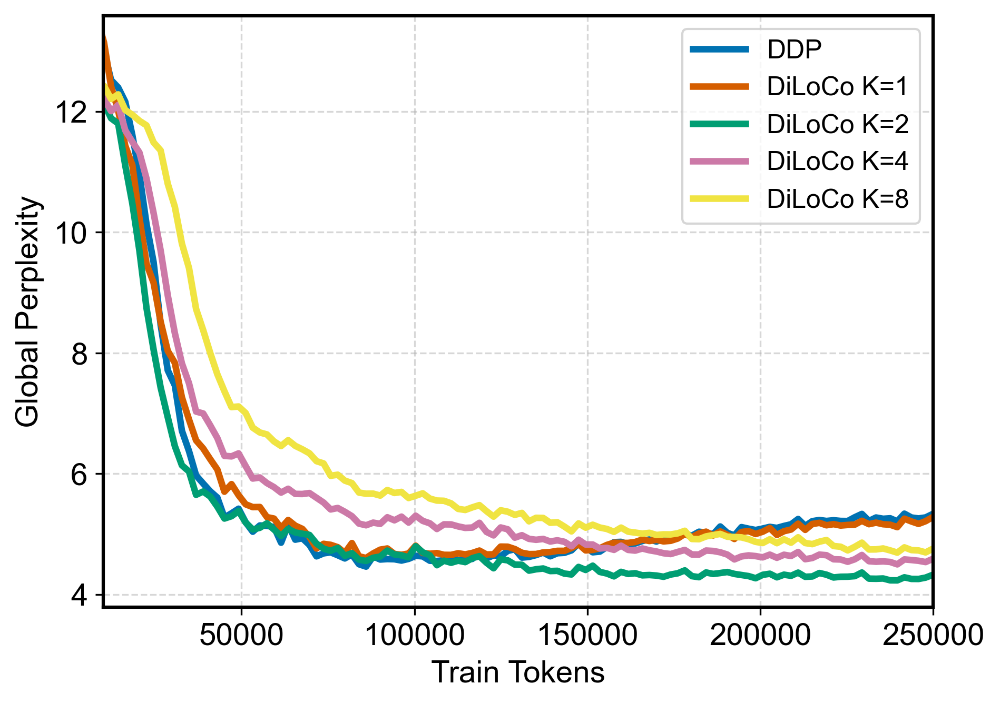

<div align="center">

<!-- # EXO Gym  -->
#  Gym


<!-- New image ideas: A macbook with a loss curve on it, with a 'thinking bubbles' coming out of the macbook, and in the bubble there is a stack of 4 H100 GPUs. It's like the laptop is imagining the cluster.  -->


##### EXO Gym: Simulate distributed training on any hardware configuration, at any scale.

Simulate a GPU cluster with just your laptop! For example:
</div>

- Use a laptop to simulate 4-node training of an image classification model using [DiLoCo](https://arxiv.org/abs/2311.08105)
- Use a single node with 4x 4090 GPUs to simulate 16-node training of a language model using [SPARTA](https://openreview.net/forum?id=stFPf3gzq1)


## Why EXO Gym?

- Simulate distributed training without setting up distributed clusters; avoid Kubernetes, Docker, and GPU hosting.
- Fast iteration: implementing a new distributed training algo from scratch takes as little as 5 lines
- Scale up number of nodes by changing a single parameter
- Switch hardware from a laptop to a multi-GPU node - with no code changes

EXO Gym spins up multiple virtual PyTorch nodes on the hardware available. The virtual nodes train in parallel across the devices, and can communicate with PyTorch primitives such as `all_reduce`.

## Supported Algorithms

- AllReduce (Equivalent to PyTorch [DDP](https://arxiv.org/abs/2006.15704))
- [FedAvg](https://arxiv.org/abs/2311.08105)
- [DiLoCo](https://arxiv.org/abs/2311.08105)
- [SPARTA](https://openreview.net/forum?id=stFPf3gzq1)
- [DeMo](https://arxiv.org/abs/2411.19870)

... and anything else you can imagine! Implementing new algorithms with EXO Gym is very simple - see <a href='#custom-algorithms'>Custom Algorithms</a>.


## Installation

### Dependencies

- `python>=3.10`

### Installation

To install:
```bash
git clone https://github.com/exo-explore/gym.git exogym
cd exogym
python3 -m venv .venv && source .venv/bin/activate
pip install -e .
```

<!-- ### Pip Installation
```bash
pip install --index-url https://test.pypi.org/simple/ --extra-index-url https://pypi.org/simple/ exogym
``` -->

## Usage

### Example Scripts

| Example | Result |
| ------- | ------ |
| **MNIST Comparison** <br><br> Compare DDP, DiLoCo, SPARTA on MNIST dataset. Runs in <2 mins on a M4 Mac Mini. <br><br> ```python example/mnist.py``` |  |
| **NanoGPT OpenWebText** <br><br> Train a NanoGPT-style transformer on the OpenWebText dataset. <br><br> ```python example/nanogpt_train.py --dataset owt --strategy diloco``` |  |
| **Shakespeare DiLoCo Scaling K** <br><br> How does DiLoCo compare for different device count (K)? This script compares DiLoCo for different device counts, normalized by FLOPs. <br><br> ```python example/diloco_scaling.py --dataset shakespeare``` <br><br> We can generate text with the model that we trained using: <br><br> ```python example/nanogpt/shakespeare_inference.py``` |  |

### Custom Training

Strategies (eg. DiLoCo, SPARTA) are portable across domains. A custom dataset and model can be trained with a distributed algorithm like so:

```python
from exogym import Trainer
from exogym.strategy.diloco import DiLoCoStrategy

train_dataset, val_dataset = ...
model = ... # model.forward() expects a batch, and returns a scalar loss

trainer = Trainer(model, train_dataset, val_dataset)

# Strategy for optimization & communication
strategy = DiLoCoStrategy(
  inner_optim='adam',
  H=100
)

trainer.fit(
  strategy=strategy,
  num_nodes=4,
  device='mps'
)
```

### Custom Algorithms

`example/playground.py` is a minimal starting-point for writing new algorithms. For example, to implement gradient quantization from scratch:

```python
class QuantizationStrategy(Strategy):
    def __init__(self, optim_spec, quantization_level: Literal['int8']):
        super().__init__()
        self.optim_spec = optim_spec
        self.scale = 0.024
        self.zero_point = 0
        self.qdtype = torch.uint8

    def step(self):
        for param in self.model.parameters():
            if param.grad is not None:
                quantized = torch.round(param.grad / self.scale + self.zero_point).clamp(0, 255).to(self.qdtype)
                
                q_wide = quantized.to(torch.int32)
                all_reduce(q_wide)
                
                param.grad = (q_wide.to(torch.float32) * self.scale) / self.num_nodes

        self.optim.step()
        super().step()
```


## Supported Devices

- CPU
- CUDA
- MPS (CPU-bound for copy operations, see [here](https://github.com/pytorch/pytorch/issues/141287))


## Technical Details

For further details on how EXO Gym works under-the-hood, please see [docs/](docs/README.md).

## Citation

If you use EXO Gym in your research, please cite:

```bibtex
@software{exogym2025,
  title={EXO Gym},
  author={Matt Beton, Mohamed Baioumy, Matt Reed, Seth Howes, Alex Cheema},
  year={2025},
  url={https://github.com/exo-explore/gym}
}
```


